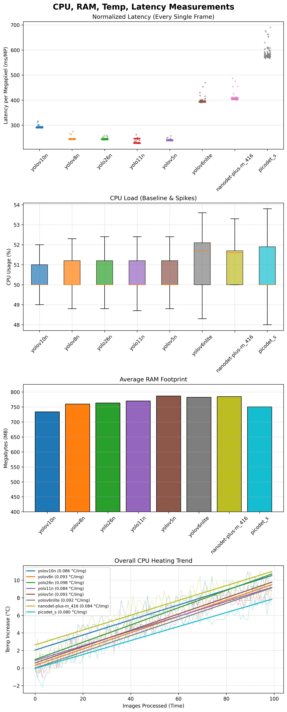
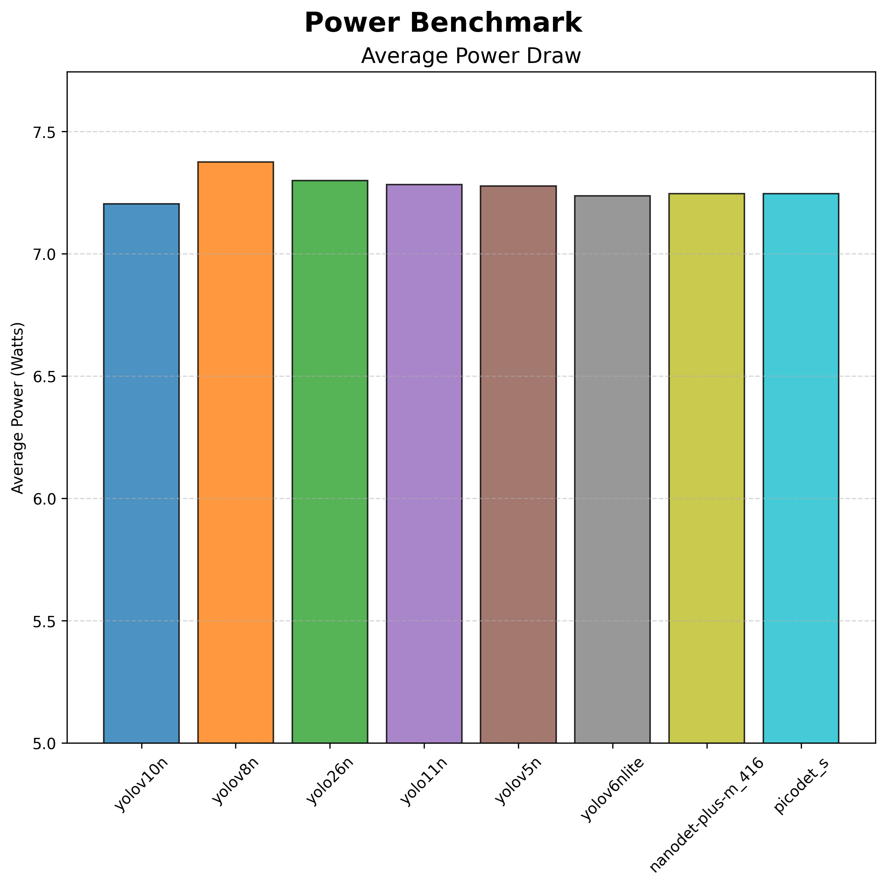

# ModelBenchmarks

## Description

This repository holds the benchmarking of pretrained CNN models for identifying objects. The model is to identify common objects within a standard household environment. The model that is the most suitable for a Raspberry Pi 5 8GB embedded system will be transferred using ONNX Runtime. The problem of real time object detection has many applications of neural networks being applied to it, and it has been recently found out that RT-DETRs often have a greater accuracy than YOLO models. While this is true for seemingly unconstrained systems, using a deep learning model on a mobile system has created the problem of making sure the model can run within strict constraints. RT-DETRs are not stable enough to be run on edge computing devices, and they do not handle quantisation or compression do their complex structure.

## Pre-requisites

After cloning this repository, install all dependencies onto a virtual environment before running this program, use the command:
```pip3 install -r requirements.txt```

## Running

Simply run the code after cloning and installing dependencies, this program will use a CUDA supported GPU if available.

## Models Used

The models used are as follows:

- YOLOv10n
- YOLOv8n
- YOLOv26n
- YOLOv11n
- YOLOv5n
- YOLOv6nlite
- NanoDet-Plus_M
- PicoDet_S

All of the models were converted to ONNX format for running on edge computing device. The YOLO models were also suitable for quantisation and have been quantised to uint8 input type.

## Results





## Author

* Julio Anandaraaj

## License

This project uses the MIT License. Please see the LICENSE.md for more details.


